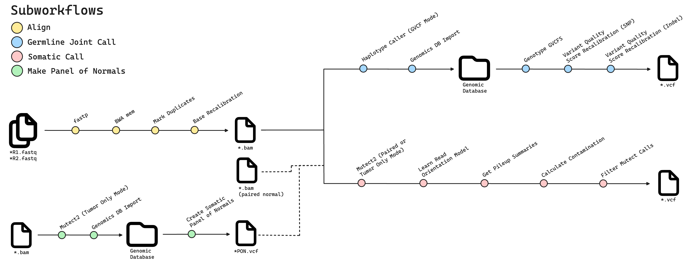

# Nextflow Workflows

Data workflows for germline joint variant calling, somatic tumor-only and tumor-normal variant calling, and panel of normals creation.

## Overview

This pipeline is designed to run germline joint variant calling and somatic variant calling from either `*.fastq` or `*.bam` input files using GATK best practices.
It was developed to handle a variety of common workflow considerations, such as custom intervals for WES/WGS, inclusion of paired normals, creation of a panel of
normals, and quality control reporting and metrics. The main subworkflows can be seen in the diagram below.



## Usage

To run these workflows, you will need to install [Nextflow](https://github.com/nextflow-io/nextflow) (23.04.3) and [Singularity](https://github.com/sylabs/singularity) (3.8.7)
on an x86_64 machine. On the first run, a Docker image will be pulled to create a Singularity container with all of the required software for the workflow.

### Sample Sheet Format

The only *required* input for the workflow is a sample sheet, which is a headerless *csv* with either two or three columns. If starting from paired-end short read `*.fastq` inputs:

```text
sample01,<absolute-path-to-sample01-R1.fastq.gz>,<absolute-path-to-sample01-R2.fastq.gz>
sample02,<absolute-path-to-sample02-R1.fastq.gz>,<absolute-path-to-sample02-R2.fastq.gz>
sample03,<absolute-path-to-sample03-R1.fastq.gz>,<absolute-path-to-sample03-R2.fastq.gz>
```

If you are starting from aligned analysis-ready `*.bam` files:

```text
sample01,<absolute-path-to-sample01.bam>
sample02,<absolute-path-to-sample02.bam>
sample03,<absolute-path-to-sample03.bam>
```

Alternatively, if you want to run the somatic call workflow with a paired normal, you must use a three-columns sample sheet, where the second and third columns are paths to the 
tumor and normal `*.bam` files, respectively.

```text
sample01,<absolute-path-to-sample01-tumor.bam>,<absolute-path-to-sample01-normal.bam>
sample02,<absolute-path-to-sample02-tumor.bam>,<absolute-path-to-sample02-normal.bam>
sample03,<absolute-path-to-sample03-tumor.bam>,<absolute-path-to-sample03-normal.bam>
```

### Preprocessing and Aligning Raw *.fastq Files

```shell
nextflow run --input fastq --samples <path-to-sample-sheet> .
```
